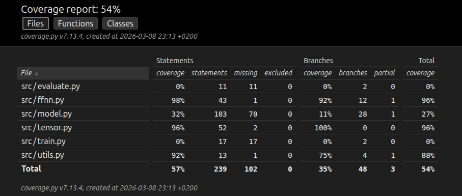

# Testing document



The tensor class has been tested with unit tests. The tensor class was tested to make sure the tensor operations used for the network work correctly and the gradients are computed correctly. The inputs for the tests were hypothetical very small-scale input vectors, weight matrices and biases.

The FFNN, Layer and Tensor classes are all tested together in end-to-end tests in the ffnn_test.py file. The tests check that the weights are updated after each backward pass and that the network is able to gain 100 % training accuracy on a small sample (50 instances) from the training data after a reasonable number of epochs. The tests also check that the average loss of each epoch decreases after each epoch for 10 epochs.

The tests can done by running

```{bash}
PYTHONPATH=src poetry run pytest
```

on the root of the project,
and the coverage report can be seen by running 
```{bash}
PYTHONPATH=src coverage run --branch -m pytest
```

and 

```{bash}
coverage report -m
```

on the root of the project.
